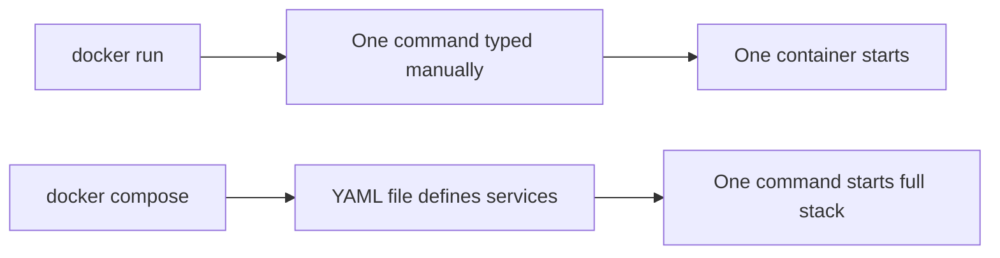

# Docker Run vs. Docker Compose

At some point, every beginner runs into this question:

> Should I use `docker run`, or should I use Docker Compose?

The practical answer is simple:

- Use **`docker run`** when you want to start **one container quickly**
- Use **Docker Compose** when you want to define and manage **one or more containers as a reusable setup**

You can think of it like this:

- `docker run` = one command, typed by hand
- `docker compose` = a saved recipe in a `docker-compose.yml` file

---

## When to use each one

| Use case | Better choice |
|---|---|
| Quick test | `docker run` |
| Learning basic flags | `docker run` |
| Reusable setup | Docker Compose |
| Multi-container app | Docker Compose |
| Team sharing | Docker Compose |
| Easier updates | Docker Compose |

---

## Visual difference



---

## Install Docker Compose

If you installed Docker Desktop, Compose is already included as `docker compose`.

If you want to install it explicitly:

```powershell
winget install -e --id Docker.DockerCompose
```

Verify:

```powershell
docker compose version
```

---

## Simple example with docker run

```powershell
docker run -d `
  --name my-nginx `
  -p 8080:80 `
  --restart unless-stopped `
  nginx
```

### Parameters explained

- `-d` → run in background
- `--name` → container name
- `-p` → port mapping (host:container)
- `--restart` → restart policy
- `nginx` → image

Open:
http://localhost:8080

---

## Same setup with Docker Compose

```yaml
services:
  nginx:
    image: nginx
    container_name: my-nginx
    ports:
      - "8080:80"
    restart: unless-stopped
```

Run:

```powershell
docker compose up -d
```

---

## Why Compose is better here

- No need to remember long commands
- Easy to edit and reuse
- Shareable config
- Cleaner structure

---

## Advanced example — Portainer (docker run)

```powershell
docker volume create portainer_data

docker run -d `
  --name portainer `
  -p 9000:9000 `
  --restart always `
  -v /var/run/docker.sock:/var/run/docker.sock `
  -v portainer_data:/data `
  portainer/portainer-ce
```

### Parameters explained

- `docker volume create` → persistent storage
- `-v host:container` → mount volume
- `/var/run/docker.sock` → allows Portainer to control Docker
- `portainer_data:/data` → saves app data
- `--restart always` → auto restart

---

## Same Portainer setup with Docker Compose

```yaml
services:
  portainer:
    image: portainer/portainer-ce
    container_name: portainer
    ports:
      - "9000:9000"
    restart: always
    volumes:
      - /var/run/docker.sock:/var/run/docker.sock
      - portainer_data:/data

volumes:
  portainer_data:
```

Run:

```powershell
docker compose up -d
```

---

## `docker compose` commands

### Start
```powershell
docker compose up
```

### Start (background)
```powershell
docker compose up -d
```

### Stop & remove
```powershell
docker compose down
```

### Remove including volumes
```powershell
docker compose down -v
```

### Restart
```powershell
docker compose restart
```

### Stop only
```powershell
docker compose stop
```

### Start stopped services
```powershell
docker compose start
```

### Status
```powershell
docker compose ps
```

### Logs
```powershell
docker compose logs
```

### Follow logs
```powershell
docker compose logs -f
```

### Pull updates
```powershell
docker compose pull
```

### Rebuild
```powershell
docker compose up --build
```

### Force recreate
```powershell
docker compose up -d --force-recreate
```

### Remove orphan containers
```powershell
docker compose up -d --remove-orphans
```

---

## Restart policies

In `docker run`:
```powershell
--restart always
```

In Compose:
```yaml
restart: always
```

### Types

- `no`
- `always`
- `unless-stopped`
- `on-failure`

---

## Final takeaway

- Use `docker run` for quick tests
- Use Docker Compose for anything you want to keep

That’s the real difference.
