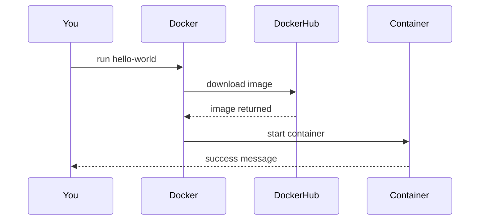

# Getting Started with Docker on Windows 11

This guide walks you from zero → running containers on Windows 11. No prior Docker knowledge needed.

We’ll cover:
- What Docker is (in plain English)
- Setting up WSL (required)
- Installing Docker Desktop using `winget`
- Running your first container
- Using Portainer as a visual UI
- Core concepts you actually need

---

## 🧠 What is Docker (and why should you care?)

Docker lets you run applications in **containers** — lightweight, isolated environments that include everything the app needs to run.

Instead of:
> "It works on my machine"

You get:
> "It works anywhere Docker runs"

---

## 🧱 How Docker Works (Simplified)


Key idea:
- Docker uses Linux under the hood
- On Windows → this is handled by WSL2

---

## ⚙️ Step 1 — Install WSL (Windows Subsystem for Linux)

Docker Desktop depends on WSL.

### Run this in PowerShell (Admin):

```powershell
wsl --install
```

This will:
- Enable WSL
- Install a Linux distro (usually Ubuntu)
- Set WSL2 as default

### Then restart your PC

---

### Verify WSL is working:

```powershell
wsl --status
```

You should see:
- Default Version: 2

---

## 🐳 Step 2 — Install Docker Desktop using Winget

### Run:

```powershell
winget install -e --id Docker.DockerDesktop
```

---

### After installation:
1. Launch Docker Desktop
2. Accept the license
3. Let it finish setup (it may restart WSL)

---

### Verify Docker is running:

```powershell
docker --version
```

---

## 🚀 Step 3 — Run Your First Container

Let’s run the classic test:

```powershell
docker run hello-world
```

### What just happened?



If everything worked, you’ll see:
> "Hello from Docker!"

---

## 📦 Step 4 — Understanding Basic Concepts (No fluff)

### 🔹 Image
A **template** for a container
Example: `nginx`, `postgres`, `hello-world`

Think:
> Blueprint

---

### 🔹 Container
A **running instance** of an image

Think:
> A live app created from the blueprint

---

### 🔹 Docker Hub
Public registry where images live

---

### 🔹 Volume
Persistent storage for containers

Without volumes:
> Data disappears when container stops

---

## 🧰 Step 5 — Install Portainer (Visual UI for Docker)

Portainer gives you:
- Web UI
- Container management
- Logs, stats, configs

---

### Option A — Docker Desktop Extension (Easiest)

1. Open Docker Desktop
2. Go to **Extensions Marketplace**
3. Search for **Portainer**
4. Click Install

---

### Option B — Run Portainer manually

```powershell
docker volume create portainer_data

docker run -d `
  -p 9000:9000 `
  --name portainer `
  --restart=always `
  -v /var/run/docker.sock:/var/run/docker.sock `
  -v portainer_data:/data `
  portainer/portainer-ce
```

---

### Access Portainer

Open:
http://localhost:9000

---

### How Portainer Fits In


---

## ⚡ Quick Example — Run a Web Server

```powershell
docker run -d -p 8080:80 nginx
```

Then open:
http://localhost:8080

---

## 🧭 Final Mental Model

- Docker = runtime
- Image = blueprint
- Container = running app
- WSL = Linux layer on Windows

---

## ✅ You're Done

You now have:
- Docker running on Windows 11
- Your first container executed
- A UI (Portainer) to manage everything

That’s Docker.
